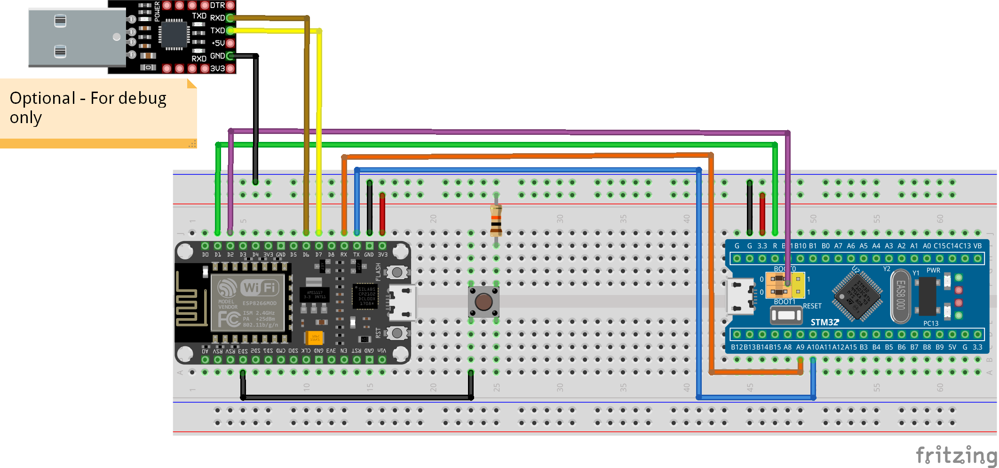
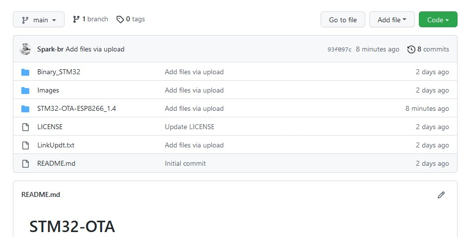
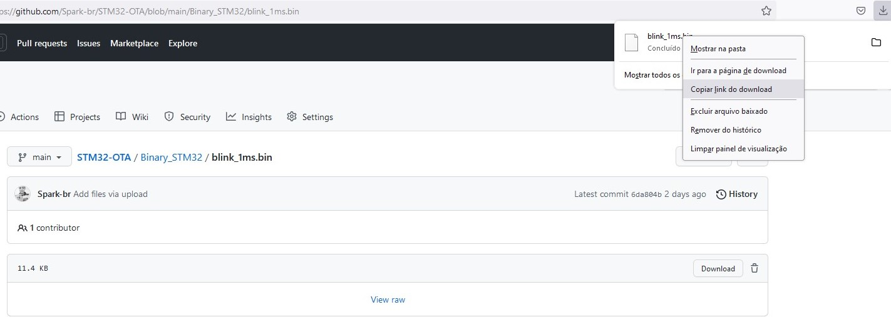
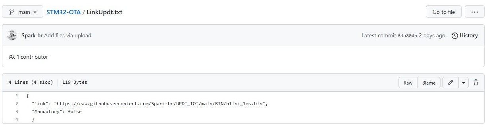
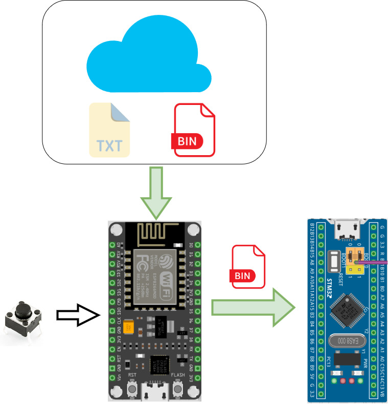

# STM32-OTA With ESP8266

### Sistema para atualizaçao remota do STM32F103C8T utilizando um ESP8266.
### [Veiw on YOUTUBE](https://www.youtube.com/watch?v=fX0JGTNInXo)

## Schematic

#### Example Using NODEMCU 
 

### Connections
|ESP8266 Pin |NodeMCU Pin |STM32 MCU |
| :-----: |:-----:| :-----:|
|RXD|RXD|PA9|
|TXD|TXD|PA10|
|Pin4|D2|BOOT0|
|Pin5|D1|RST|
|Vcc|3.3|3.3V|
|GND|GND|GND|

### Connection for Debug-only 

|ESP8266|USB-SERIAL |
| :-----: |:-----:|
|D6|TX-SERIAL|
|D7|RX-SERIAL|

'********************************************************************************************'
# Configuraçao:

  Passoa a psso de como configura o sistema para realizar a atualizaçao OTA de forma altomatica.

## 1) Upload do arquivo binario.
1)Os arquivos deverao esta no repositorio.
2)Ao fazer o Upload de um binario novo utilize um nome diferente dos anteriores, para evitar poblemas de atualizaçao.

## 2) Ciaçao do arquivo de atualizaçao
Apos o upload do arquivo binario, e necessario obter o link de acesso direto ao arquivo, para isso faça os seguinte passos:

1) faça o download do arquivo binario.

2) Apos o download do arquivo, abra o gerenciador de download e copie o link de download do arquivo. O link começa com: "https://raw.githubusercontent.com/"

   
Para o correto funcionamento do sistema de atualizaçao é necessario criar um arquivo de configuraçao, esse aquivo é quem vai dizer ao ESP8266 qual arquivo devera ser utilizado, e onde ele estara armazenado.

3)Criar um aruivo no formato.txt. (exemple :LinkUpdt.txt).

4)Dentro do arquivo txt, devara conter um JSON contemdo a seguinte estrutura:

{ 
"link": "https://raw.githubusercontent.com/yourepository/xxxxx/youfile.bin", 
"Mandatory": false 
  }

 O "link:", sera o link direto do arquivo binario.
  

## 3) configuraçao na IDE do Arduino.
 O proximo passo e configurar o codigo fonte do arduino, sendo necessario modificar os seguintes parametos:

>const char* ssid = "XXXXXXXXX"; //you ssid 
>const char* password = "XXXXXXXX"; //you password 
>const char* link_Updt =   "XXXXXXXXXXXXX";//link of file im you Repository 
  
O "link_Updt" , e o link direto do aquivo de cunfiguraçao, e ele pode ser obtido da mesma maneira que o link do arquivo .bin.  

  
    
-----
### How to Work  
      

-----
### BTW
* If you want to keep STM32-bootloader, please change the STM32STADDR in "stm32ota.h"    
>\#define STM32STADDR  	0x8000000     // STM32 codes start address, you can change to other address if use custom bootloader: like 0x8002000

-----
## TODO: 
> 1. 
> 2. Make a video upload to Youtube.
